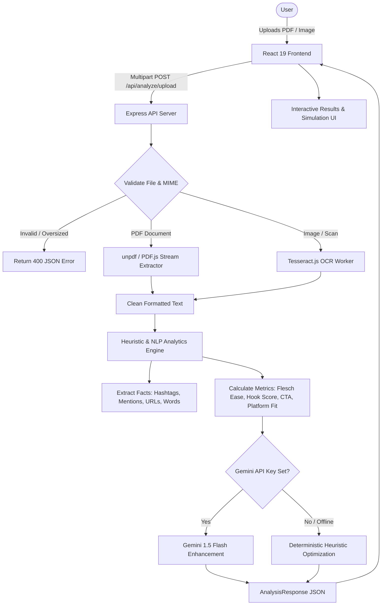

# Social Media Content Analyzer

A full-stack, production-grade web application engineered to parse PDF documents and scanned images, extract structured text using PDF stream parsing and Tesseract OCR, calculate actionable social media engagement metrics, and generate strategic recommendations for viral performance.

---

## Table of Contents

1. [Project Overview](#1-project-overview)
2. [Key Features](#2-key-features)
3. [Tech Stack](#3-tech-stack)
4. [Architecture & System Flow](#4-architecture--system-flow)
5. [How PDF Extraction Works](#5-how-pdf-extraction-works)
6. [How OCR Works](#6-how-ocr-works)
7. [How Social Media Analysis Works](#7-how-social-media-analysis-works)
8. [Local Setup Instructions](#8-local-setup-instructions)
9. [Environment Variables](#9-environment-variables)
10. [How to Run Development Mode](#10-how-to-run-development-mode)
11. [How to Build for Production](#11-how-to-build-for-production)
12. [Deploying to Vercel (Step-by-Step)](#12-deploying-to-vercel-step-by-step)
13. [Limitations](#13-limitations)
14. [Future Improvements](#14-future-improvements)

---

## 1. Project Overview

Content creators, founders, and social media managers frequently draft posts in PDFs or capture post ideas via screenshots and scanned flyers. **Social Media Content Analyzer** bridges the gap between raw document ingestion and post-readiness.

The application allows users to upload any PDF or image document via drag-and-drop or file picker, extracts the text while strictly preserving paragraph layout and whitespace, computes deep linguistic and engagement metrics, and offers 1-click alternative rewrites optimized for maximum organic reach.

---

## 2. Key Features

- **Multi-Format Document Upload**:
  - Drag-and-drop & native file picker.
  - Seamless handling for PDF documents (`.pdf`) and image files (`.png`, `.jpg`, `.jpeg`, `.webp`, `.bmp`, `.tiff`).
  - Preloaded sample library for instant 1-click testing.
  - 15MB file size validation and in-memory processing.
- **High-Fidelity Text Extraction**:
  - Native PDF stream text extraction preserving paragraph hierarchy, bullet indentations, and multi-page flows.
  - Tesseract.js Optical Character Recognition (OCR) with confidence scoring for scanned graphics.
  - Clear extraction method badge & metadata (file size, parse duration, page counts).
- **Interactive Extracted Content Editor**:
  - Live in-place editor allowing users to tweak or refine extracted text.
  - Real-time "Save & Re-Analyze" button for instant feedback loops.
  - 1-click clipboard copy with visual feedback.
- **Deep Social Media Analytics & Scoring**:
  - **Extracted Facts**: Word count, character count, sentence count, detected hashtags (`#`), mentions (`@`), links (`http/https`), and questions (`?`).
  - **Calculated Metrics**:
    - **Overall Engagement Score (0-100)** with Grade (`A+` to `F`).
    - **Hook Strength Analyzer**: Evaluates the opening line for curiosity, contrarian angle, questions, or statistical proof.
    - **Call-to-Action (CTA) Detection & Quality Index**: Identifies direct action, link clicks, comments, and community saves.
    - **Readability & Complexity**: Flesch Reading Ease score, Flesch-Kincaid Grade Level, average sentence length.
    - **Sentiment & Tone Classifier**: Detects optimism, enthusiasm, urgency, or thought-leadership tone.
- **Multi-Platform Compatibility Simulator**:
  - Real-time preview and character limit bars for **X / Twitter** (280 chars), **LinkedIn** (3,000 chars), **Instagram** (2,200 chars), **Facebook** (63,206 chars), and **Threads** (500 chars).
- **Strategic Engagement Recommendations & 1-Click Rewrites**:
  - Actionable priority-tagged optimization items (High/Medium/Low).
  - 1-Click Copyable Alternative Variations:
    - *Short & Punchy* (X/Twitter thread opener).
    - *LinkedIn Thought Leadership* (Hook, whitespace, and takeaways).
    - *Community Q&A* (High-comment conversational framework).
  - Optional Google Gemini AI integration with 100% offline fallback heuristics.

---

## 3. Tech Stack

- **Frontend**:
  - **React 19** + **TypeScript**
  - **Vite 6** (lightning-fast build & HMR)
  - **Tailwind CSS 3.4** (minimalist monochrome design system)
  - **Lucide React** (feather-light line icons)
- **Backend / API**:
  - **Node.js** (v20+) + **Express 4.21** + **TypeScript**
  - **Multer** (in-memory buffer handling; zero temp file leaks)
  - **unpdf / PDF.js** (high-accuracy standard PDF stream extraction)
  - **Tesseract.js** (client/server OCR engine with local model caching)
- **Deployment**:
  - **Vercel** serverless native configuration (`vercel.json` + `api/index.ts`)

---

## 4. Architecture & System Flow



---

## 5. How PDF Extraction Works

1. The file buffer is received in-memory by Multer.
2. `unpdf` parses the binary object streams and cross-reference tables without writing to disk.
3. Text glyph coordinates are extracted across all pages.
4. Consecutive carriage returns are sanitized while preserving logical paragraph breaks (`\n\n`) and bullet indentations.
5. Extraction duration and page count are cataloged in the metadata payload.

---

## 6. How OCR Works

1. For image uploads (`PNG`, `JPG`, `WEBP`, `TIFF`, `BMP`), a dedicated Tesseract OCR worker is initialized.
2. The image buffer is analyzed for optical character glyphs against English language trained models.
3. Extracted text is normalized to remove scanner artifacts, OCR confidence percentages are measured, and the worker process is safely terminated in a `finally` block to prevent worker leaks.

---

## 7. How Social Media Analysis Works

The application avoids fabricating vanity metrics (like arbitrary likes or impressions). Instead, it analyzes the copy structure:

1. **Facts Extraction**: Direct regex extraction of hashtags (`#[a-zA-Z0-9_]`), mentions (`@[a-zA-Z0-9_]`), URLs, and questions.
2. **Hook Scoring**: Analyzes the opening sentence for questions, curiosity gaps, quantifiable numbers, or bold contrarian declarations.
3. **CTA Detection**: Recognizes 7 distinct conversion categories (Link in Bio, Direct Action, Question Discussion, Share/Save, DM, Urgency).
4. **Readability Formula**:
   $$\text{Flesch Reading Ease} = 206.835 - 1.015 \left(\frac{\text{words}}{\text{sentences}}\right) - 84.6 \left(\frac{\text{syllables}}{\text{words}}\right)$$
5. **Platform Constraints**: Validates length sweet-spots and hard limits for Twitter (280), LinkedIn (3,000), Instagram (2,200), Facebook (63,206), and Threads (500).

---

## 8. Local Setup Instructions

### Prerequisites
- **Node.js** >= 18.0.0 (Node 20+ recommended)
- **npm** >= 9.0.0

### Step-by-Step Installation

1. **Navigate to the workspace**:
   ```bash
   cd /Users/armaanbudhiraja/social-media-content-analyzer
   ```

2. **Install all root, backend, and frontend dependencies**:
   ```bash
   npm run postinstall
   ```

3. **Configure Environment Variables**:
   ```bash
   cp .env.example .env
   ```

---

## 9. Environment Variables

Create a `.env` file in the root directory:

```env
# Server Port
PORT=5001

# Client URL (for CORS)
CLIENT_URL=http://localhost:3000

# Optional: Google Gemini API Key (leaves app 100% functional offline if omitted)
# GEMINI_API_KEY=your_gemini_api_key_here
```

---

## 10. How to Run Development Mode

Run both the backend API server and Vite frontend concurrently with a single command:

```bash
npm run dev
```

- **Frontend Client**: `http://localhost:3000`
- **Backend API**: `http://localhost:5001`
- **Health Endpoint**: `http://localhost:5001/api/health`

---

## 11. How to Build for Production

To create an optimized production build for both client and server:

```bash
npm run build
```

To start the local production server:
```bash
npm run start
```
The server will now serve both the API endpoints and the static SPA dashboard on `http://localhost:5001`.

---

## 12. Deploying to Vercel (Step-by-Step)

For complete instructions, refer to [`DEPLOYMENT_VERCEL.md`](./DEPLOYMENT_VERCEL.md).

### Quick Vercel Deploy:

1. **Push to GitHub**:
   ```bash
   git init && git add . && git commit -m "feat: initial commit"
   git remote add origin https://github.com/<your-username>/social-media-content-analyzer.git
   git push -u origin main
   ```
2. **Import on Vercel**:
   - Go to [https://vercel.com/new](https://vercel.com/new) and import your repository.
   - Click **Deploy**.
   - Your full-stack application will be live with a public URL!

---

## 13. Limitations

- **Complex Multi-Column Tables**: Heavily stylized multi-column tables in PDFs may linearize text column-by-column rather than row-by-row.
- **Handwritten Documents**: Low-contrast cursive handwriting OCR accuracy depends on image clarity and lighting.
- **Offline Mode**: In environments without internet access, Gemini API defaults to local heuristics.

---

## 14. Future Improvements

- **Multi-Language OCR**: Add support for Spanish, French, German, and Japanese OCR packages.
- **Direct Social Media Scheduling**: Integrations with Twitter/LinkedIn APIs for 1-click publishing.
- **Historical Content Tracking**: SQLite / PostgreSQL persistence to compare post iterations over time.

